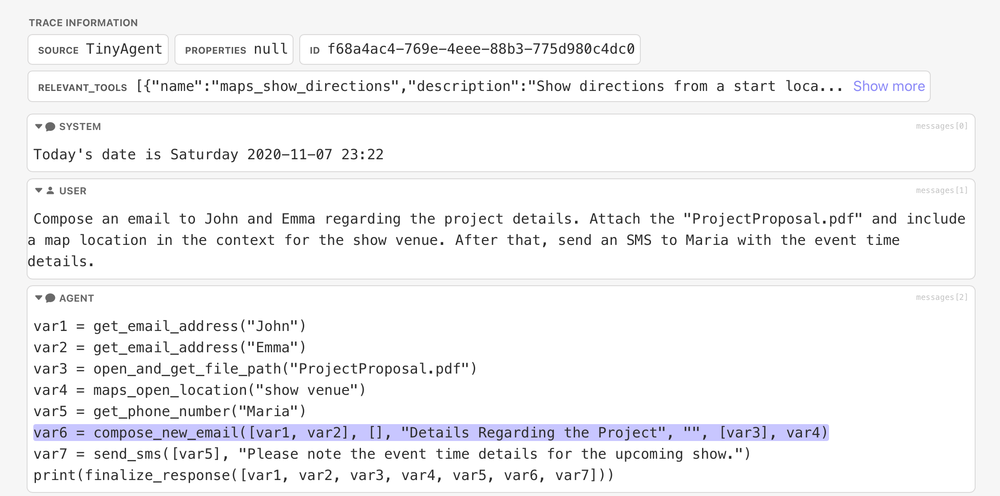

# Annotations

<div class='subtitle'>Learn how to annotate traces in Explorer to add context and structure</div>

In addition to hosting agent traces, Explorer can also be used to annotate traces with additional information, as created in error analysis, human labeling or by other means. 

Annotations provide additional context, facilitating collaboration and agent error and security analysis.

<figure class='wide'>



<figcaption>An annotated trace in Explorer</figcaption>

</figure>

## Annotation Format

You can add annotations to traces at upload time. For this, both during [file upload](./Uploading_Traces/file_uploads.md) and via the [Push API](./Uploading_Traces/push_api.md), you can include an `annotations` field in the trace data. This field should be an array of objects, each representing an annotation. Each annotation object should have the following fields:

##### `content` <span class='type'>string</span> <span class='required'/>

The content of the annotation.

##### `address` <span class='type'>string</span> <span class='required'/>

The address of the span to annotate. This should be in the format `<path>:<start>-<end>`, where `<path>` is the path to an object in the event log, and `<start>` and `<end>` are the start and end indices of the character range to annotate.

##### `extra_metadata` <span class='type'>Optional[Dict[Any, Any]]</span> <span class='optional'/>

Additional metadata for the annotation.

Each metadata dictionary can have arbitrary keys and values for storing additional information about the annotation.

> Example Annotation
    ```json
    {
        "content": "This is an example annotation",
        "address": "messages.0.content:5-10",
        "extra_metadata": {
            "source": "my-analyzer"
        }
    }
    ```
