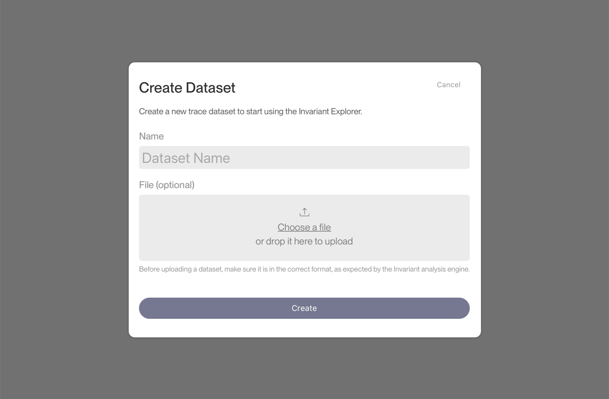

# File Uploads

<div class='subtitle'>Upload datasets to Explorer via the browser</div>

Apart from API-based uploads, you can also upload datasets to Explorer using the file upload UI. This is useful when you have a dataset in a ready-to-upload [`jsonl`](https://jsonlines.org) format and want to upload it to Explorer.

## Browser-Based File Upload

To upload a dataset to Explorer, navigate to the [home page](https://explorer.invariantlabs.ai) and click on the `New Dataset` button. This will open the file upload dialog.



Click on the `Choose a File` button and select the dataset file from your local machine. Once the file is selected, click on the `Create` button to start the upload process.

To ensure a successful upload, make sure your dataset is in the correct format as described next.

## `JSONL` Format

The explorer supports two types of trace formats: _raw event lists_ and _annotated event lists_.

#### Raw Event Lists

Raw event lists are `jsonl` files where each line is a JSON array of events. Each event is a dictionary with at least a `role` and `content` field according to the trace format described [in this chapter](../2_traces.md).

```json
[{ "role": "user", "content": "Hello, world!" }, { "role": "assistant", "content": "Hi!" }]
[{ "role": "user", "content": "How are you?" }, { "role": "assistant", "content": "I'm good, thanks!" }]
...
```

To include trace-level metadata in raw event lists, include a metadata JSON object as the first event in a line. Metadata is optional and can be used to store additional information about a specific trace.

```json
[{"metadata": {"key": "value"}}, { "role": "user", "content": "Hello, world!" }, { "role": "assistant", "content": "Hi!" }]
```

#### Annotated Event Lists

Annotated event lists support the same format as raw event lists, but also include [annotations](../3_annotations.md). 

For this, each line is a JSON object with the fields `messages`, `annotations` (optional) and `metadata` (optional, for trace-level metadata).

```json
{"messages": [{ "role": "user", "content": "Hello, world!" }, { "role": "assistant", "content": "Hi!" }], "annotations": [{"content": "example annotation", "address": "messages.0.content:5-10"}], "metadata": {"key": "value"}}
{"messages": [{ "role": "user", "content": "How are you?" }, { "role": "assistant", "content": "I'm good, thanks!" }], "annotations": [], "metadata": {}}
```

### Dataset-Level Metadata

In addition to trace-level metadata, you can also provide metadata at the dataset level.

To provide dataset metadata, include the following metadata JSON object as the first line of your uploaded `.jsonl` file. Like with trace-level metadata, dataset metadata is optional and can be of any structure to store additional information about the dataset.

```json
{"metadata": {...}}
```

Dataset-level metadata is support for both raw and annotated event lists.
