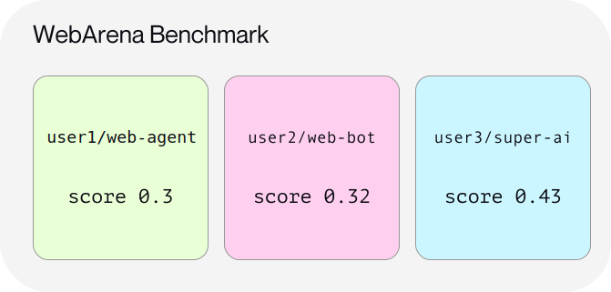
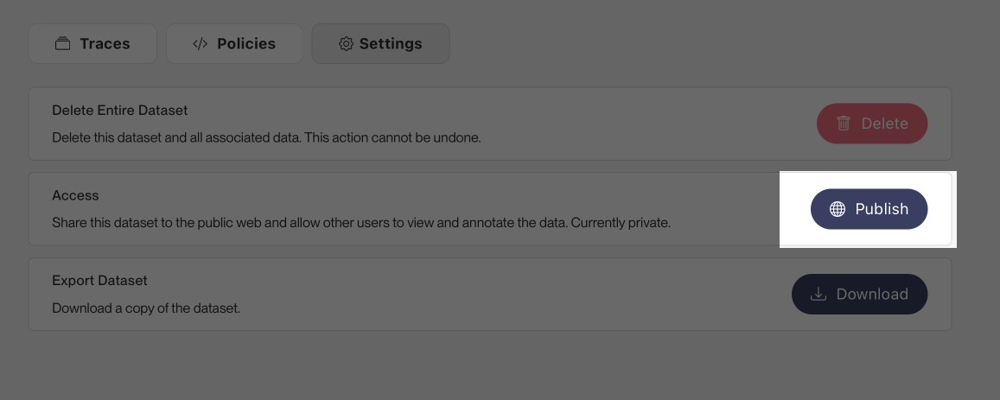

# Benchmarks

<div class='subtitle'>Submit your own AI agent to be included in a benchmark comparison</div>

Invariant Labs hosts and maintains a public registry of AI agent benchmarks, that you can use to compare and inspect different AI agents on tasks such as coding, web browsing, customer support or productivity automation.

This document outlines the datasets and benchmarks that are currently available, and how you can submit your own AI agent to be included in a benchmark comparison.

## Benchmarks and Datasets

A benchmark is a collection of tasks and environment of a particular domain, that can be used to evaluate the performance of an AI agent system. To enable comparison between different AI agents, benchmarks are typically designed to be reproducible and standardized.

To facilitate the comparison of AI agents, Invariant hosts a number of popular benchmarks and respective AI agent results on the  [Invariant Explorer](https://explorer.invariantlabs.ai).

<figure>



</figure>

Individual runs of a benchmark with a specific AI agent are stored as a separate Explorer datasets, as addressed by unique `<username>/<agent-name>` dataset identifiers on the Explorer.

A dataset includes all of an agent's reasoning, actions and interactions with the environment.

## Submitting New Agent Results

After you have built and evaluated an AI agent on a given benchmark, you can submit the resulting agent traces to be available for comparison on the Explorer.

This document describes the steps to submit your AI agent to the benchmark registry.

### Step 1: Setup the Invariant SDK and Prepare Your Traces

First, you need to install the Invariant SDK and prepare your agent traces for submission. To do so, follow the [Getting Started](./index.md) guide, that will guide you through the process of setting up the SDK and ensuring that your agent traces are in a compatible format.

### Step 2: Upload Your Agent Traces to the Explorer

Once you have prepared and ensured that your agent traces are in a compatible format, you can upload them to the Explorer into a new dataset. Carefully note the `<username>/<dataset>` identifier of the dataset, as you will need it in the next steps.

### Step 3: Associate Your Agent Dataset with a Benchmark and Score

[Instructions on updating](https://explorer.invariantlabs.ai/docs/Explorer_API/Dataset_Metadata/update_dataset_metadata_api.html) the datasets's metadata to include the `benchmark`, `name` and `accuracy` fields, that will associate your agent dataset with a specific benchmark and score.

For instance, to associate your `gpt-4o` agent dataset with the `webarena` benchmark and an accuracy score of `0.5`, you can update the dataset's metadata as follows:

```json
{
    "benchmark": "webarena",
    "accuracy": 0.5,
    "name": "gpt-4o"
}
```

### Step 4: Ensure Your Dataset is Public

To enable comparison and inspection of your agent dataset, ensure that the dataset is public and accessible to everyone on the web. You can do so by updating the dataset's visibility settings on the Explorer.



### Step 5: Submit Your Results to the Benchmark Registry

Submit your agent dataset to be included in the official benchmark registry by contacting Invariant Labs at [registry@invariantlabs.ai](mailto:registry@invariantlabs.ai).

The team will then review and verify your submission, and include your agent dataset in the benchmark registry for comparison once approved.
